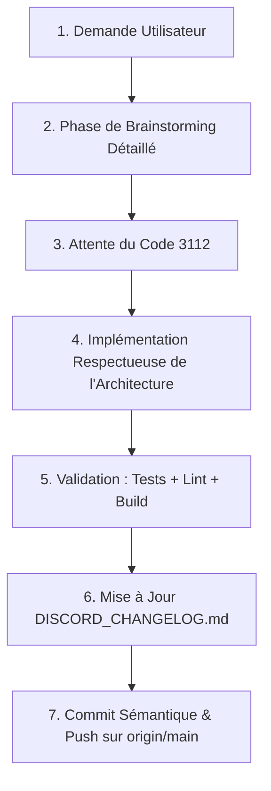

# 🤖 Directives & Guidelines pour les Agents IA — FGF WIKI (Août 2026)

Ce document constitue la **charte opérationnelle obligatoire** pour tout agent d'intelligence artificielle (Antigravity, Claude, Cursor, Copilot, etc.) ou développeur travaillant en mode *Vibecoding* sur le projet **FGF WIKI**.

Toute intervention sur ce dépôt doit se conformer strictement aux 10 règles fondamentales ci-dessous.

---

## ⚡ Les 11 Commandements du Vibecoding sur FGF WIKI



### 1. 🧠 Toujours Brainstormer d'Abord (Ne Rien Coder Immédiatement)
À chaque nouvelle demande ou tâche :
- Présenter d'abord un diagnostic clair et un plan d'action détaillé (ce qui doit et va être fait).
- Lister les fichiers impactés et la justification des choix techniques.
- **Ne modifier aucun fichier source du projet tant que l'utilisateur n'a pas validé.**

### 2. 🔐 Règle du Code de Validation Explicite `3112`
- **Rien ne doit être validé, modifié ou exécuté sans l'accord explicite de l'utilisateur sous la forme du code `3112` envoyé dans le chat.**
- Si l'utilisateur répond avec des questions ou des ajustements, adapter la proposition et redemander confirmation.

### 3. 🚀 Push Systématique sur `origin/main`
- Une fois les changements implémentés, testés et vérifiés avec succès, **effectuer systématiquement un push sur la branche `main` de GitHub** :
  ```bash
  git add .
  git commit -m "type(scope): description claire"
  git push origin main
  ```

### 4. 🛡️ Intégrité du Code & Préservation du Contexte
- Préserver systématiquement les commentaires techniques, docstrings et contextes existants.
- Ne jamais supprimer de code fonctionnel sans raison explicite validée dans le plan.
- Respecter le typage implicite et les conventions de style du projet.

### 5. 🧱 Respect de l'Arborescence & Découpage Modulaire
Tout nouveau fichier doit être placé dans le bon sous-dossier selon sa responsabilité :
- **Vues / Pages complètes** ➡️ `src/components/pages/`
- **Éléments de structure globale** ➡️ `src/components/layout/`
- **Fenêtres modales accessibles** ➡️ `src/components/modals/`
- **Calculateurs & outils interactifs** ➡️ `src/components/tools/`
- **Composants UI partagés / atomiques** ➡️ `src/components/common/`
- **Logique pure, algorithmes & calculs** ➡️ `src/lib/` *(impératif : aucun JSX ici)*
- **Requêtes Firestore & services externes** ➡️ `src/services/`
- **Custom Hooks React** ➡️ `src/hooks/`
- **Données encyclopédiques statiques** ➡️ `src/data/`

### 6. ⚛️ Conformité React 19 & Fast Refresh
- **Exports stricts** : Les fichiers `.jsx` ne doivent exporter que des composants React (règle `react-refresh/only-export-components`). Les fonctions utilitaires doivent être logées dans `src/lib/`.
- **Hooks & Effets** : Interdiction formelle d'appeler `setState` de manière synchrone dans le corps direct d'un `useEffect`. Utiliser la dérivation d'état, les callbacks d'événements, ou des promesses asynchrones avec guard d'annulation (`isSubscribed = false`).

### 7. 🔒 Sécurité Firestore & Authentification Admin
- **Compte Administrateur Officiel** : L'email administrateur strict est **`fgfwiwi@gmail.com`**.
- Ne jamais utiliser le pseudonyme (`displayName`) pour octroyer des privilèges administrateur (faille d'usurpation).
- Toute modification des structures de données Firestore doit s'accompagner de la mise à jour des règles dans `firestore.rules`.

### 8. 🌐 Parité Absolue des 23 Langues (i18n)
- Toute nouvelle clé de traduction ajoutée dans `public/locales/en/translation.json` **DOIT être obligatoirement propagée dans les 22 autres langues** :
  `ar`, `de`, `es`, `fi`, `fr`, `id`, `it`, `ja`, `ko`, `ms`, `nb`, `nl`, `pl`, `pt`, `ru`, `sv`, `th`, `tr`, `uk`, `vi`, `zh`, `zh-tw`.
- Le test `npm test` vérifie cette complétude automatiquement.

### 9. 🎨 Accessibilité (WCAG 2.2 AA) & Design System
- Utiliser systématiquement les variables du thème Asimov-Gold (`--gold`, `--text-primary`, `--text-secondary`, `--text-dim: #5E5B50`, `--bg-void`, `--bg-surface`, `--bg-elevated`).
- Tout élément cliquable personnalisé doit comporter `role="button"`, `tabIndex={0}`, `aria-label`, et un gestionnaire clavier pour les touches `Enter` et `Space`.
- Toute modale doit intégrer `role="dialog"`, `aria-modal="true"`, un identifiant de titre `aria-labelledby`, et un écouteur de fermeture sur la touche `Escape`.

### 10. 🧪 La Triade de Validation Obligatoire Avant Commit
Aucun commit ni push ne peut être effectué si l'une des trois commandes suivantes échoue :
```bash
npm test          # 1. Tous les tests Vitest doivent passer (100%)
npm run lint      # 2. 0 erreur et 0 warning ESLint
npm run build     # 3. Compilation Vite propre sans erreur d'import
```

### 11. 📢 Maintenance Systématique du `DISCORD_CHANGELOG.md`
- Toute mise à jour ou évolution du site doit **obligatoirement s'accompagner de la mise à jour du fichier [`DISCORD_CHANGELOG.md`](file:///Users/andrevieira/Documents/GitHub/FGF%20WIKI/DISCORD_CHANGELOG.md)**.
- **Langue & Ton** : Anglais naturel, humain et authentique (style développeur/joueur passionné, sans aucun biais d'écriture ou tournure robotique d'IA).
- **Formatage Discord Prêt au Partage** : Structure pensée pour un simple copier/coller dans Discord (titres `##`, listes à puces claires, emojis pertinents, mise en avant immédiate des bénéfices pour les joueurs).

---

## 📋 Checklist d'Auto-Évaluation pour l'Agent avant de Conclure

- [ ] Ai-je brainstormé et attendu le code `3112` de l'utilisateur ?
- [ ] Mes fichiers sont-ils rangés dans les sous-dossiers adéquats (`pages/`, `layout/`, `modals/`, `tools/`, `common/`, `lib/`, `services/`) ?
- [ ] Les fonctions pures sont-elles dans `src/lib/` sans violer Fast Refresh ?
- [ ] Toutes les nouvelles clés de traduction sont-elles présentes dans les 23 fichiers de langue ?
- [ ] Les règles Firestore sont-elles à jour et sécurisées pour `fgfwiwi@gmail.com` ?
- [ ] Le fichier `DISCORD_CHANGELOG.md` a-t-il été actualisé en anglais humain et prêt pour Discord ?
- [ ] La commande `npm test` passe-t-elle avec 100% de succès ?
- [ ] La commande `npm run lint` affiche-t-elle 0 erreur et 0 warning ?
- [ ] La commande `npm run build` compile-t-elle sans warning ?
- [ ] Le push sur `origin/main` a-t-il été effectué ?
