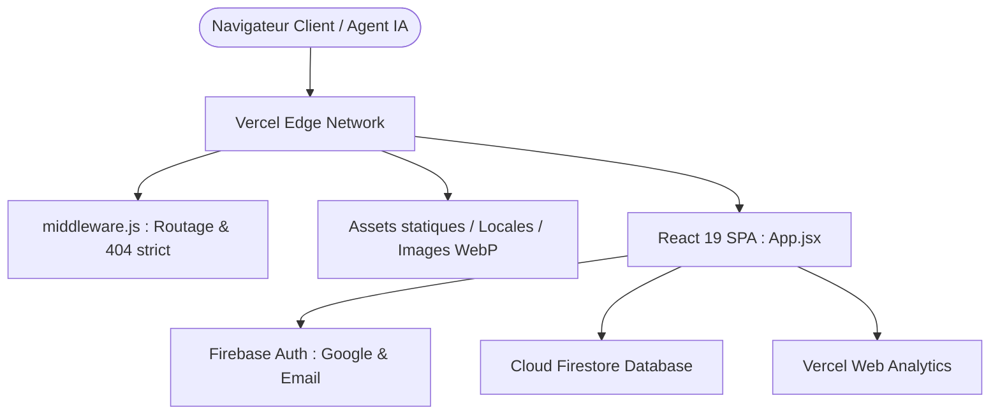

# 🏛️ FGF WIKI — Guide d'Architecture Technique (Août 2026)

Bienvenue dans le document de référence d'architecture de **FGF WIKI** (`fgfwiki.com`), la plateforme communautaire et base de connaissances encyclopédique de référence mondiale pour le jeu *Foundation: Galactic Frontier*.

Ce document détaille l'organisation structurelle, le modèle de données, les flux d'authentification, la sécurité Firestore, le système d'internationalisation (23 langues) et les exigences de performance Web Vitals.

---

## 📑 Sommaire
1. [Vue d'Ensemble & Stack Technique](#1-vue-densemble--stack-technique)
2. [Arborescence & Responsabilités des Dossiers](#2-arborescence--responsabilités-des-dossiers)
3. [Architecture Frontend & Cycle de Vie React 19](#3-architecture-frontend--cycle-de-vie-react-19)
4. [Backend & Modèle de Données Firestore](#4-backend--modèle-de-données-firestore)
5. [Système de Sécurité & Rôles](#5-système-de-sécurité--rôles)
6. [Système d'Internationalisation (i18n — 23 Langues)](#6-système-dinternationalisation-i18n--23-langues)
7. [Design System "Asimov-Gold" & Accessibilité (WCAG 2.2 AA)](#7-design-system-asimov-gold--accessibilité-wcag-22-aa)
8. [SEO, GEO & Découvrabilité par les Agents IA](#8-seo-geo--découvrabilité-par-les-agents-ia)
9. [Pipeline de Build & Déploiement Edge](#9-pipeline-de-build--déploiement-edge)

---

## 1. Vue d'Ensemble & Stack Technique



### Technologies Principales (Août 2026)
- **Framework UI** : React 19.x (Hooks stricts, mode Concurrent, imports asynchrones `React.lazy`)
- **Bundler & Build Tool** : Vite 8.x avec moteur Rust **Rolldown** (`codeSplitting` moderne)
- **Routage** : React Router v7 avec support du préfixe linguistique dynamique (`/fr/guides`, `/de/news/`, etc.)
- **Base de Données & Auth** : Firebase 12.x (Cloud Firestore temps réel + Google Authentication)
- **Internationalisation** : `i18next` + `react-i18next` avec **23 langues supportées à 100% de parité**
- **Iconographie** : `lucide-react`
- **Hébergement & CDN** : Vercel Edge Network avec middleware Edge natif
- **Qualité & Tests** : ESLint 10 (Flat Config) + Vitest 4 (5 suites de tests automatisés)

---

## 2. Arborescence & Responsabilités des Dossiers

```text
FGF WIKI/
├── architecture.md           # 📘 Ce document (bible technique)
├── agents.md                 # 🤖 Directives opérationnelles pour les agents IA & vibecoders
├── firestore.rules           # 🛡️ Règles de sécurité Firestore en production
├── vercel.json               # 🌐 Configuration de réécriture Vercel
├── middleware.js             # ⚡ Middleware Edge pour la validation des routes
├── vite.config.js            # ⚙️ Configuration de compilation Vite & Rolldown
├── eslint.config.js          # 🧹 Configuration ESLint 10 Flat Config
├── package.json
│
├── public/                   # 📦 Assets publics statiques distribués tels quels
│   ├── locales/              # 🌐 23 répertoires de langues (en, fr, de, es, zh, etc.)
│   ├── images/               # 🖼️ Images WebP optimisées (héros, vaisseaux, skins)
│   ├── assets/               # 🌌 Image hero LCP et icônes PWA
│   ├── robots.txt            # 🤖 Directives IA (GPTBot, ClaudeBot, PerplexityBot...)
│   ├── llms.txt / llms-full  # 📑 Documentation contextuelle standardisée pour LLMs
│   ├── sitemap.xml           # 🗺️ 1173 URLs indexées multi-langues
│   ├── sw.js                 # ⚡ Service Worker offline/cache PWA
│   └── manifest.webmanifest  # 📱 Configuration Progressive Web App
│
├── src/
│   ├── main.jsx              # Point d'entrée React, StrictMode & ErrorBoundary
│   ├── App.jsx               # Routage React Router, Suspense & Modales globales
│   ├── index.css             # Thème sombre Asimov-Gold, tokens CSS & typographie
│   ├── i18n.js               # Initialisation i18next & détection de langue
│   │
│   ├── context/              # Contextes React partagés
│   │   └── AuthContext.jsx   # État d'authentification Firebase & profils Traders
│   │
│   ├── components/           # Composants d'interface classés par responsabilité
│   │   ├── layout/           # Squelette, navigation et structure globale
│   │   │   ├── Layout.jsx           # Conteneur principal & animation d'ambiance
│   │   │   ├── Header.jsx           # Barre supérieure, profil & sélecteur de langue
│   │   │   ├── Tabs.jsx             # Navigation par onglets (Desktop & Mobile Drawer)
│   │   │   ├── LanguageSwitcher.jsx # Sélecteur déroulant des 23 langues
│   │   │   └── ErrorBoundary.jsx    # Capture des erreurs d'affichage
│   │   │
│   │   ├── pages/            # Vues complètes (Routes applicatives)
│   │   │   ├── Hero.jsx             # Page d'accueil & présentation
│   │   │   ├── GameEvolutions.jsx   # Espace de propositions & timeline communautaire
│   │   │   ├── News.jsx             # Actualités officielles & roadmap des développeurs
│   │   │   ├── Guides.jsx           # Guides stratégiques (débutant, combat, économie)
│   │   │   ├── HeroTierList.jsx     # Tier list des champions & compositions au sol
│   │   │   ├── FlagshipGuide.jsx    # Guide des vaisseaux amiraux & decks méta
│   │   │   ├── EventGuide.jsx       # Calendrier et guides des événements
│   │   │   ├── StellaAnomaly.jsx    # Événement interactif de décryptage & podium
│   │   │   ├── CreatorsCorner.jsx   # Espace créateurs de contenu & vidéos
│   │   │   ├── GiftCodes.jsx        # Codes cadeaux actifs & archivés
│   │   │   ├── GuildTool.jsx        # Outil de gestion de guilde
│   │   │   ├── Builder.jsx          # Portail des calculateurs du jeu
│   │   │   └── NotFound.jsx         # Page d'erreur 404 spatiale
│   │   │
│   │   ├── tools/            # Calculateurs de jeu modulaires
│   │   │   ├── BuildTimeCalculator.jsx       # Simulateur de temps de construction
│   │   │   ├── ChampionUpgradeCalculator.jsx # Coûts de montée de niveau des héros
│   │   │   ├── CombatCraftCalculator.jsx     # Calculateur de puissance d'artisanat
│   │   │   ├── GvGCalculator.jsx             # Simulateur de score & points GvG
│   │   │   ├── NexusCalculator.jsx           # Arbre d'amélioration du Nexus
│   │   │   ├── ToolUI.jsx                    # Primitives d'interface pour les calculateurs
│   │   │   └── tools.css                     # Styles spécifiques aux calculateurs
│   │   │
│   │   ├── modals/           # Fenêtres modales accessibles
│   │   │   ├── LoginModal.jsx        # Connexion Google / Magic Link / Email
│   │   │   ├── ProfileSetupModal.jsx # Configuration du pseudonyme et serveur
│   │   │   └── SearchModal.jsx       # Recherche Spotlight universelle (Cmd+K)
│   │   │
│   │   └── common/           # Composants atomiques réutilisables
│   │       ├── TipCard.jsx          # Carte de présentation d'un guide ou d'une actualité
│   │       ├── TeamDisplay.jsx      # Affichage graphique d'une escouade de héros
│   │       ├── CommentSection.jsx   # Espace commentaires temps réel Firestore
│   │       ├── TranslatableText.jsx # Composant de traduction automatique (Google Cloud)
│   │       └── AmbientSignal.jsx    # Effet sonore d'ambiance et signal radio
│   │
│   ├── services/             # Couche d'accès aux données & API
│   │   ├── firebase.js       # Initialisation des instances Firebase App, Auth & Firestore
│   │   ├── firebaseUtils.js  # Requêtes Firestore optimisées & abonnements temps réel
│   │   └── translate.js      # Service de traduction Google Cloud avec cache local
│   │
│   ├── hooks/                # Custom React Hooks
│   │   ├── useSEO.js         # Injection dynamique des métadonnées, OpenGraph & JSON-LD
│   │   ├── useFavorites.js   # Gestion des favoris joueurs (champions, guides, decks)
│   │   └── useAmbientSignal.js # Gestion de l'audio synthétisé
│   │
│   ├── lib/                  # Logique pure de calcul (sans JSX ni dépendance DOM)
│   │   ├── evolutions.js     # Algorithme de scoring d'engagement & tiers de priorité
│   │   ├── championCost.js   # Tables et formules d'expérience des champions
│   │   └── pdfExport.js      # Générateur de rapport PDF paysage A4 exécutif avec synthèse IA
│   │
│   └── data/                 # Données statiques encyclopédiques
│       ├── gameData.js       # Données des guides, actualités, tiers et decks
│       ├── builderData.js    # Données des bâtiments et modificateurs de vitesse
│       ├── nexusData.js      # Données des nœuds d'énergie du Nexus
│       └── mirandusVideos.json # Liste statique des vidéos YouTube de référence
│
├── tests/                    # Suites de tests automatisés Vitest
│   ├── calculators.test.js   # Validation des formules mathématiques des outils
│   ├── championCost.test.js  # Validation des paliers de coût des héros
│   ├── evolutions.test.js    # Validation de l'algorithme de scoring communautaire
│   └── seo.test.js           # Validation de la parité 100% des 23 langues & SEO
│
└── scripts/                  # Scripts de maintenance & pipelines de build
    ├── generate-sitemap.js       # Générateur automatique de sitemap.xml
    ├── optimize-images.js        # Script de conversion et compression WebP
    ├── sync-all-translations.js  # Outil de synchronisation et propagation des clés i18n
    └── update-videos.js          # Synchronisation des dernières vidéos de créateurs
```

---

## 3. Architecture Frontend & Cycle de Vie React 19

### Règles Clés React 19
1. **Séparation Stricte JSX / Fonctions Pures** :
   - Aucun export de fonctions utilitaires ou de calcul hors d'un composant dans un fichier `.jsx` (pour garantir le fonctionnement de Fast Refresh).
   - Toute fonction pure doit résider dans `src/lib/`.
2. **Effets et Immutabilité (`react-hooks/set-state-in-effect`)** :
   - Aucun appel `setState` synchrone dans le corps direct d'un `useEffect`.
   - L'état de chargement asynchrone doit être déclenché soit via les gestionnaires d'événements, soit à l'intérieur des callbacks de promesses avec un guard d'annulation (`isSubscribed = false`).
3. **Chargement Différé (`React.lazy`)** :
   - Toutes les pages de l'application sont chargées à la demande via `React.lazy()` afin de maintenir le bundle initial sous la barre des 105 KB compressés.

---

## 4. Backend & Modèle de Données Firestore

Cloud Firestore est utilisé en mode temps réel (avec listeners `onSnapshot`).

### Collections Firestore
| Collection | Description | Permissions d'Écriture |
| :--- | :--- | :--- |
| `/users/{uid}` | Profil du joueur (`displayName`, `serverNumber`, sauvegardes des outils) | Propriétaire du document uniquement (`request.auth.uid == uid`) |
| `/comments/{commentId}` | Commentaires sur les guides et actualités | Utilisateur authentifié (`authorUid == auth.uid`) ; suppression par l'auteur |
| `/evolutions/{evolutionId}` | Suggestions communautaires de fonctionnalités | Création : Authentifié ; Update : Votes seuls (ou Admin) ; Suppression : Auteur ou Admin |
| `/evolution_comments/{commentId}` | Commentaires sur les propositions d'évolution | Création : Authentifié ; Suppression : Auteur ou Admin |
| `/stella_anomaly_submissions/{id}` | Soumissions du code secret de l'événement | Authentifié (avec vérification de code) |
| `/stella_anomaly_leaderboard/{id}` | Podium public de l'événement | Écriture serveur / Admin uniquement |

---

## 5. Système de Sécurité & Rôles

### Rôle Administrateur Strict
- Le compte administrateur officiel est le compte Google : **`fgfwiki@gmail.com`** / **`fgfwiki@google.com`** (avec `fgfwiwi@gmail.com` et `vieira.andre@proton.me` en liste blanche).
- **Règles Firestore** : La fonction serveur `isAdmin()` valide strictement l'email du token d'authentification (`request.auth.token.email`).
- **Client React** : La variable `isAdmin` dans `GameEvolutions.jsx` et `Header.jsx` se base exclusivement sur l'adresse email vérifiée. Aucune vérification par nom d'affichage (`displayName`) n'est autorisée.

---

## 6. Système d'Internationalisation (i18n — 23 Langues)

FGF WIKI propose une expérience traduite dans 23 langues avec **100% de complétude** sur l'intégralité des **1 820 clés** :
`en` (référence), `ar`, `de`, `es`, `fi`, `fr`, `id`, `it`, `ja`, `ko`, `ms`, `nb`, `nl`, `pl`, `pt`, `ru`, `sv`, `th`, `tr`, `uk`, `vi`, `zh`, `zh-tw`.

### Principes Directeurs
1. **Fichier Unique par Langue** : `public/locales/{lang}/translation.json`.
2. **Routage Linguistique** : L'URL peut être préfixée (ex: `/es/news`, `/ja/guides`). Si aucun préfixe n'est présent, la langue mémorisée dans `localStorage` ou la langue du navigateur est utilisée.
3. **Parité Garantie par Tests** : Le test unitaire `tests/seo.test.js` valide à chaque commit qu'aucune clé ne manque dans aucune des 23 langues.

---

## 7. Design System "Asimov-Gold" & Accessibilité (WCAG 2.2 AA)

### Palette de Couleurs Sémantiques (`src/index.css`)
- `--bg-void: #060709` : Fond cosmique profond
- `--bg-surface: #0E1015` : Surface principale
- `--bg-elevated: #151821` : Cartes et conteneurs surélevés
- `--gold: #C9A84C` : Or impérial (accentuation principale)
- `--text-primary: #E8E4D9` : Texte principal haute lisibilité
- `--text-secondary: #8A8778` : Texte secondaire descriptif
- `--text-dim: #5E5B50` : Texte tertiaire et métadonnées discrètes

### Normes d'Accessibilité
- Toutes les modales comportent `role="dialog"`, `aria-modal="true"` et s'échappent via la touche `Escape`.
- Les cartes interactives disposent de `role="button"`, `tabIndex={0}` et d'écouteurs clavier `Enter` / `Space`.
- L'image hero principale au-dessus de la ligne de flottaison est configurée en `loading="eager"` et `fetchPriority="high"` pour optimiser le LCP.

---

## 8. SEO, GEO & Découvrabilité par les Agents IA

1. **Métadonnées Dynamiques (`useSEO.js`)** : Titre canonique, description OpenGraph, image de partage (`og-image.png`) et balises Twitter Card générées par route et par langue.
2. **Données Structurées JSON-LD** : Injection automatique des schémas `WebApplication`, `BreadcrumbList`, `Article` et `FAQPage`.
3. **Crawlers IA & GEO (Generative Engine Optimization)** :
   - `public/robots.txt` autorise explicitement les robots d'indexation IA (`GPTBot`, `ClaudeBot`, `PerplexityBot`, `Google-Extended`, `Applebot`).
   - `public/llms.txt` et `public/llms-full.txt` fournissent un résumé synthétique et exhaustif pour l'ingestion par les modèles de langage.
   - `public/sitemap.xml` indexe **1 173 URLs uniques**.

---

## 9. Pipeline de Build & Déploiement Edge

```bash
# 1. Validation de la qualité du code
npm run lint

# 2. Exécution de la suite de tests automatisés
npm test

# 3. Génération du sitemap et compilation optimisée
npm run build
```

- **Déploiement Continu** : Tout push sur la branche `main` déclenche le déploiement immédiat sur Vercel Edge.
- **Middleware Vercel (`middleware.js`)** : Intercepte les requêtes pour exclure les assets statiques et renvoyer un véritable code HTTP 404 sur les URLs inexistantes.
